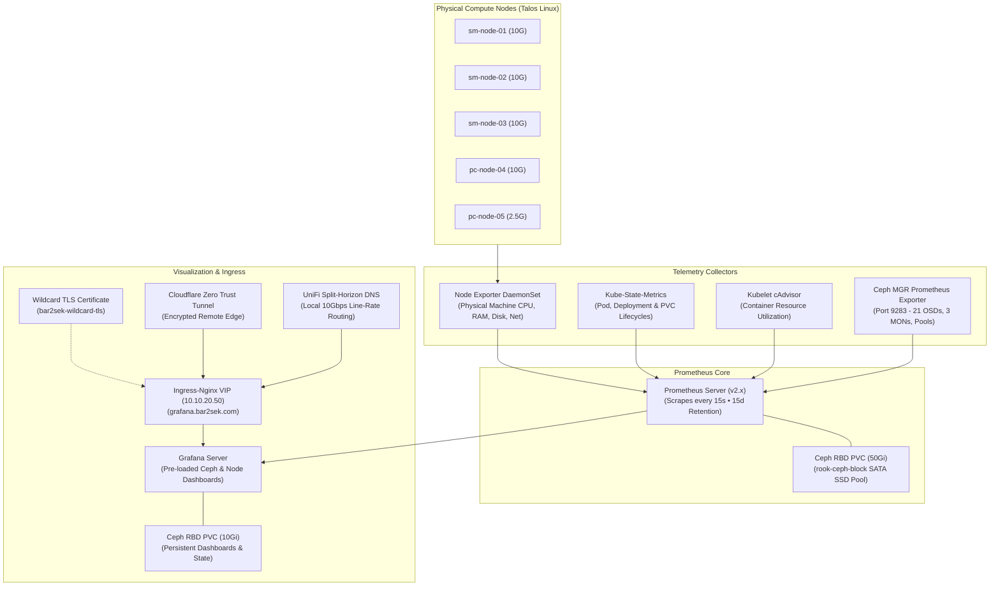

# 📊 Phase 3: Observability Stack (Prometheus, Grafana & Ceph Monitoring)

This document details the architecture, storage integration, Talos Linux node scraping configuration, and dashboard workflows for the hybrid homelab monitoring stack.

---

## 🏗 Architectural Overview

The observability stack is deployed via `kube-prometheus-stack` into the dedicated `monitoring` namespace, backed by persistent Ceph RBD block storage, and exposed through Ingress-Nginx with automated Let's Encrypt wildcard TLS.



---

## 💾 Storage Layer & Ceph Persistence

All telemetry time-series data and visualization state are persisted onto the replicated Ceph storage cluster deployed in Phase 2:

| Component | Storage Class | PVC Size | Retention Policy | Failure Domain |
| :--- | :--- | :--- | :--- | :--- |
| **Prometheus TSDB** | `rook-ceph-block` | `50Gi` | 15 days (`retentionSize: 45Gi`) | Replicated 3x (Host Failure Domain) |
| **Grafana Data** | `rook-ceph-block` | `10Gi` | Retained across pod restarts | Replicated 3x (Host Failure Domain) |
| **Alertmanager** | `rook-ceph-block` | `5Gi` | Alert silence state & notification logs | Replicated 3x (Host Failure Domain) |

---

## ⚙️ Talos Linux Compatibility & Control-Plane Scrapes

Talos Linux is an immutable, API-driven operating system without standard `/etc/os-release`, package managers, or interactive shells. To ensure 100% metrics accuracy without false alerts:

1. **Control-Plane Tolerations**:
   Control plane nodes (`sm-node-01`, `sm-node-02`, `sm-node-03`) carry the taint `node-role.kubernetes.io/control-plane:NoSchedule`. All collectors, operators, and daemonsets carry matching tolerations so physical machine telemetry is gathered across all 5 nodes.

2. **Node-Exporter Rootfs Mounting**:
   `hostRootFsMount.enabled: true` mounts `/host/proc` and `/host/sys` into the Node Exporter containers to capture actual hardware CPU cycles, memory allocations, physical disk I/O, and 10GbE network interfaces.

3. **Static Pod Scrape Suppression**:
   In Talos Linux, `kube-controller-manager` and `kube-scheduler` run as containerized static pods bound strictly to localhost or secured internal gRPC endpoints. Direct unauthenticated HTTP scrapes are disabled in `values.yaml` (`kubeControllerManager.enabled: false`, `kubeScheduler.enabled: false`, `kubeProxy.enabled: false`) to eliminate false-positive target unreachable alerts.

---

## 🐙 Rook-Ceph Storage Integration

Enabling native Ceph monitoring in `CephCluster` (`spec.monitoring.enabled: true`) activates:

1. **Ceph MGR Prometheus Module**:
   Ceph Manager daemons (`mgr-a` on `sm-node-03`, `mgr-b` on `pc-node-04`) actively serve metrics on port `9283`.

2. **Rook-Ceph ServiceMonitor**:
   The Rook operator registers `rook-ceph-mgr` in the `rook-ceph` namespace. Because Prometheus is configured with `serviceMonitorSelectorNilUsesHelmValues: false`, it automatically discovers and scrapes this endpoint without manual namespace tagging.

3. **Pre-Configured Ceph Dashboards**:
   Grafana automatically provisions official production dashboards:
   - **Ceph - Cluster Overview** (ID: 2842): Storage cluster health, raw available capacity (42.3 TiB), IOPS, and read/write bandwidth.
   - **Ceph - OSDs** (ID: 5336): Real-time breakdown of all 21 OSDs, NVMe/SSD/HDD latency heatmaps, and fill ratios.
   - **Ceph - Pools** (ID: 5337): Capacity and compression efficiency across `nvme-high-iops-pool`, `builtin-ssd-pool`, and `hdd-bulk-pool`.
   - **Node Exporter Full** (ID: 1860): Physical server telemetry across all 5 nodes.

---

## 🌐 Ingress & Split-Horizon DNS Resolution

* **Domain**: `grafana.bar2sek.com`
* **Local Resolution**: Authoritative A record on UDM-Pro (`10.0.1.1`) resolving directly to `10.10.20.50` (MetalLB Ingress-Nginx VIP).
* **Remote Resolution**: Cloudflare Zero Trust Tunnel routing traffic through encrypted QUIC tunnels with email-based authentication.
* **TLS Security**: Wildcard Let's Encrypt certificate (`bar2sek-wildcard-tls`) automatically verified by browsers with zero warnings.

---

## 🛠 Operational Runbook & Commands

All monitoring operations are integrated into the root `Justfile`:

```bash
# Check status of monitoring pods and persistent volume claims
just monitoring-status

# Retrieve the initial Grafana admin password
just grafana-password

# View all cluster pods including monitoring
just k8s-pods
```
