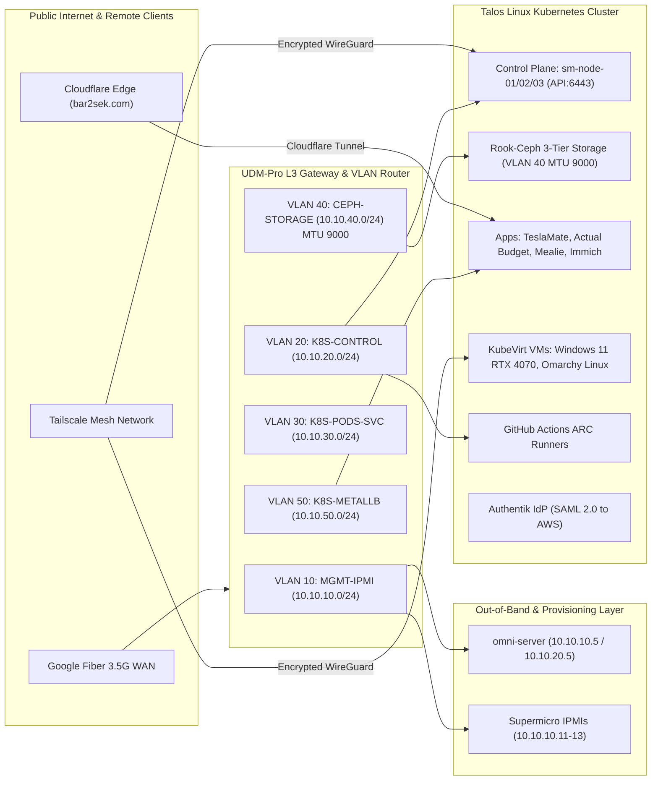

# UniFi Network Topology & VLAN Architecture

This document details the physical network topology, switch interconnects, WAN configuration, and VLAN layout for the Talos Linux homelab cluster.

---

## 🌐 Physical Network Infrastructure

### Core Hardware & Discovered MACs

- **Gateway / Router**: Ubiquiti UniFi Dream Machine Pro (UDM-Pro) (`68:d7:9a:50:ee:2d` - `10.0.1.1`)
- **WAN Interface**: 3.5 Gbps Google Fiber connected to **UDM-Pro Port 11 (SFP+ WAN2)** via TP-Link `TL-SM5310-T` SFP+ to 10GBASE-T Transceiver (negotiated at 10G; IPv6 Prefix Delegation `/56`).
- **Core Switches**: 2x **UniFi Switch Aggregation (USW-Aggregation)**
  - **USW-Aggregation #1** (`f4:92:bf:a3:37:65` - `10.0.1.224`)
  - **Ceph-USW-Aggregation (#2)** (`f4:e2:c6:5d:d6:f8` - `10.0.1.59`)
  - Inter-Switch Backbone: **20 Gbps LAG (2-Port 10G SFP+ Link Aggregation)** on Ports 7 & 8 between Aggregation Switch 1 and Aggregation Switch 2.
  - Uplink: UDM-Pro Port 10 (SFP+ 10G) connected to USW-Aggregation fabric.
- **Access Switch (Core)**: 1x **UniFi Switch 24 (USW-24-G2)** (`24:5a:4c:60:bb:09` - `10.0.1.30`) (24x 1GbE RJ45 + 2x 1G SFP)
  - Dedicated access switch for Out-of-Band IPMI/BMC ports, Omni Mini PC 1GbE NIC, and 1GbE management interfaces.
  - Uplink: Port 8 connected to UDM-Pro / USW-Aggregation.
- **Access Switch (Garage)**: 1x **UniFi Switch Lite 8 PoE (USW-Lite-8-PoE)** (`78:45:58:82:8a:39` - `10.0.1.40`)
  - 8-port Gigabit switch with 802.3at PoE+ located in the garage to power garage AP and peripheral hardware.
  - Uplink: 1GbE RJ45 connection (Port 8) to core USW-24-G2 (Port 24).
- **Wireless Infrastructure (Access Points)**:
  - **Home Wi-Fi 7 AP**: 1x **UniFi U7 Pro WAP** (`94:2a:6f:c4:ec:04` - `10.0.1.214`) connected to USW-24-G2 Port 6 for primary household wireless coverage.
  - **Garage Wi-Fi 6 AP**: 1x **UniFi U6-Lite WAP** (`24:5a:4c:13:ae:3c` - `10.0.1.45`) connected to USW-Lite-8-PoE Port 1 for garage/outdoor IoT and vehicle wireless coverage.
- **Node 05 Multi-Gig Uplink**: `pc-node-05` 2.5GbE Onboard RJ45 connected to **USW-Aggregation** SFP+ port via TP-Link Multi-Gig SFP+ 10GBASE-T Transceiver (auto-negotiated at **2.5 Gbps**).

---

## 🔌 Physical Cabling & Port Interconnect Diagram

The diagram below details the physical cables, interface types (10G SFP+, 2.5G SFP+, 1G SFP, 1G RJ45), and port assignments connecting every device in the homelab:

```mermaid
graph TD
    %% Internet & Core Gateway
    WAN["3.5G Google Fiber WAN"] -->|10GBASE-T SFP+ Transceiver| UDMP_P11["UDM-Pro Port 11 (SFP+ WAN)"]
    
    %% Gateway Uplinks
    UDMP_P10["UDM-Pro Port 10 (10G SFP+ LAN)"] -->|10G SFP+ DAC Cable| AGG1_P1["USW-Aggregation #1 Port 1"]
    UDMP_P1["UDM-Pro Port 1 (1G RJ45)"] -->|Cat6 RJ45| U7PRO["U7 Pro WAP (Home Wi-Fi 7)"]
    UDMP_P2["UDM-Pro Port 2 (1G RJ45)"] -->|Cat6 RJ45| LITE8_P1["USW-Lite-8-PoE Port 1 (Garage Switch)"]

    %% Garage Switch & AP
    LITE8_P8["USW-Lite-8-PoE Port 8 (802.3at PoE)"] -->|Cat6 RJ45| U6LITE["U6-Lite WAP (Garage Wi-Fi 6)"]

    %% Core Switch Aggregation 20G LAG Backbone
    AGG1_P7["USW-Agg #1 Port 7 (10G SFP+)"] ===|10G SFP+ DAC - 20G LAG| AGG2_P7["USW-Agg #2 Port 7 (10G SFP+)"]
    AGG1_P8["USW-Agg #1 Port 8 (10G SFP+)"] ===|10G SFP+ DAC - 20G LAG| AGG2_P8["USW-Agg #2 Port 8 (10G SFP+)"]

    %% Switch Aggregation to 1G Access Switch
    AGG1_P2["USW-Agg #1 Port 2 (10G SFP+)"] -->|1G SFP Transceiver| USW24_SFP1["USW-24-G2 SFP Port 25 (1G SFP)"]

    %% 10G SFP+ Server & PC Connections
    AGG1_P3["USW-Agg #1 Port 3 (10G SFP+)"] -->|10G SFP+ Fiber/DAC| SM1_10G1["sm-node-01 Port 1 (10G SFP+)"]
    AGG2_P3["USW-Agg #2 Port 3 (10G SFP+)"] -->|10G SFP+ Fiber/DAC| SM1_10G2["sm-node-01 Port 2 (10G SFP+)"]

    AGG1_P4["USW-Agg #1 Port 4 (10G SFP+)"] -->|10G SFP+ Fiber/DAC| SM2_10G1["sm-node-02 Port 1 (10G SFP+)"]
    AGG2_P4["USW-Agg #2 Port 4 (10G SFP+)"] -->|10G SFP+ Fiber/DAC| SM2_10G2["sm-node-02 Port 2 (10G SFP+)"]

    AGG1_P5["USW-Agg #1 Port 5 (10G SFP+)"] -->|10G SFP+ Fiber/DAC| SM3_10G1["sm-node-03 Port 1 (10G SFP+)"]
    AGG2_P5["USW-Agg #2 Port 5 (10G SFP+)"] -->|10G SFP+ Fiber/DAC| SM3_10G2["sm-node-03 Port 2 (10G SFP+)"]

    AGG1_P6["USW-Agg #1 Port 6 (10G SFP+)"] -->|10G SFP+ Fiber/DAC| PC4_10G1["pc-node-04 Port 1 (10G SFP+)"]
    AGG2_P6["USW-Agg #2 Port 6 (10G SFP+)"] -->|10G SFP+ Fiber/DAC| PC4_10G2["pc-node-04 Port 2 (10G SFP+)"]

    AGG2_P1["USW-Agg #2 Port 1 (10G SFP+)"] -->|2.5G SFP+ Transceiver| PC5_2G["pc-node-05 2.5GbE Onboard RJ45"]

    %% USW-24-G2 1G Management Connections
    USW24_P1["USW-24-G2 Port 1 (1G RJ45)"] -->|1G RJ45| OMNI["omni-server (Dell OptiPlex)"]
    USW24_P2["USW-24-G2 Port 2 (1G RJ45)"] -->|1G RJ45| SM1_IPMI["sm-node-01 IPMI Port"]
    USW24_P3["USW-24-G2 Port 3 (1G RJ45)"] -->|1G RJ45| SM2_IPMI["sm-node-02 IPMI Port"]
    USW24_P4["USW-24-G2 Port 4 (1G RJ45)"] -->|1G RJ45| SM3_IPMI["sm-node-03 IPMI Port"]
    USW24_P5["USW-24-G2 Port 5 (1G RJ45)"] -->|1G RJ45| PC4_1G["pc-node-04 1GbE Onboard"]
    USW24_P6["USW-24-G2 Port 6 (1G RJ45)"] -->|1G RJ45| PC5_USB["pc-node-05 1GbE USB Adapter"]
```



---

## 🌐 Logical Network & Traffic Flow Architecture

This diagram illustrates how traffic flows logically across subnets, VLANs, remote access tunnels, and Kubernetes service layers:



---

## 🏷 VLAN & Subnet Architecture (Proposed)

To ensure maximum security, QOS, and high storage performance for Rook-Ceph, we propose the following VLAN layout in UniFi:

| VLAN ID | Name | Subnet Range | Purpose & Traffic Description |
| :--- | :--- | :--- | :--- |
| **VLAN 10** | `MGMT-IPMI` | `10.10.10.0/24` | Out-of-Band Management (Supermicro IPMI / BMC ports, UDM-Pro admin, Omni Mini PC). |
| **VLAN 20** | `K8S-CONTROL` | `10.10.20.0/24` | Talos API (`6443`), Kubelet, etcd (`2379/2380`), and Omni provisioning traffic. |
| **VLAN 30** | `K8S-PODS-SVC` | `10.10.30.0/24` | Kubernetes Pod CNI network (Cilium / Calico) & Service nodeports. |
| **VLAN 40** | `CEPH-STORAGE` | `10.10.40.0/24` | Dedicated **10G SFP+** East-West storage replication network for Rook-Ceph OSDs. |
| **VLAN 50** | `K8S-METALLB` | `10.10.50.0/24` | Ingress LoadBalancer VIP pool allocated by MetalLB / Cilium BGP to route traffic from UniFi. |

---

## ⚙️ UniFi Configuration Notes

1. **Jumbo Frames (MTU 9000)**: Enable Jumbo Frames on the `CEPH-STORAGE` VLAN and USW-Aggregation switch ports connected to the nodes to maximize 10GbE Ceph throughput and lower CPU overhead.
2. **BGP Routing (Optional)**: If using Cilium for CNI, UniFi Dream Machine Pro / USW-Aggregation supports BGP routing to dynamically advertise Kubernetes LoadBalancer IPs directly into the network.

---

## 🤖 Infrastructure as Code (Terraform UniFi Provider)

All UniFi networks, VLANs, static DHCP reservations, and firewall rules can be declaratively managed using Terraform via the [UniFi Terraform Provider](https://registry.terraform.io/providers/paultag/unifi/latest/docs).

### Example `unifi_network` Terraform Resource:

```hcl
resource "unifi_network" "ceph_storage" {
  name          = "CEPH-STORAGE"
  purpose       = "corporate"
  vlan_id       = 40
  subnet        = "10.10.40.1/24"
  dhcp_start    = "10.10.40.10"
  dhcp_stop     = "10.10.40.254"
  dhcp_enabled  = true
  domain_name   = "ceph.homelab.local"
  
  # IPv6 Prefix Delegation (Google Fiber UDM-Pro)
  ipv6_interface_type = "pd"
  ipv6_pd_start       = "::2"
  ipv6_pd_stop        = "::7d1"
  dhcp_v6_enabled     = true
}

resource "unifi_user" "sm_node_01" {
  mac        = "00:25:90:xx:xx:xx"
  name       = "sm-node-01-10g"
  fixed_ip   = "10.10.40.11"
  network_id = unifi_network.ceph_storage.id
}

---

## 🌐 Dual-Stack IPv4 / IPv6 Architecture

Having **Google Fiber IPv6 Prefix Delegation (DHCPv6-PD)** enabled on your UDM-Pro unlocks native **Dual-Stack Kubernetes networking**:

1. **Native IPv6 Routing (No NAT Overhead)**:
   - Google Fiber delegates a public IPv6 `/56` or `/64` prefix to your UDM-Pro.
   - Pods running inside Cilium CNI can receive globally-routable IPv6 addresses or ULA (Unique Local Address) prefixes, enabling direct end-to-end IPv6 routing without Network Address Translation (NAT64/NAT44).
2. **Talos Linux Dual-Stack Support**:
   - Talos Linux natively supports dual-stack `ip` configurations in machine specs. Node interfaces automatically pick up IPv6 SLAAC / DHCPv6 addresses.
3. **AWS Route53 & ExternalDNS IPv6 (AAAA Records)**:
   - ExternalDNS and AWS ACK can publish both `A` (IPv4) and `AAAA` (IPv6) records to AWS Route53 for external cluster endpoints.
```
