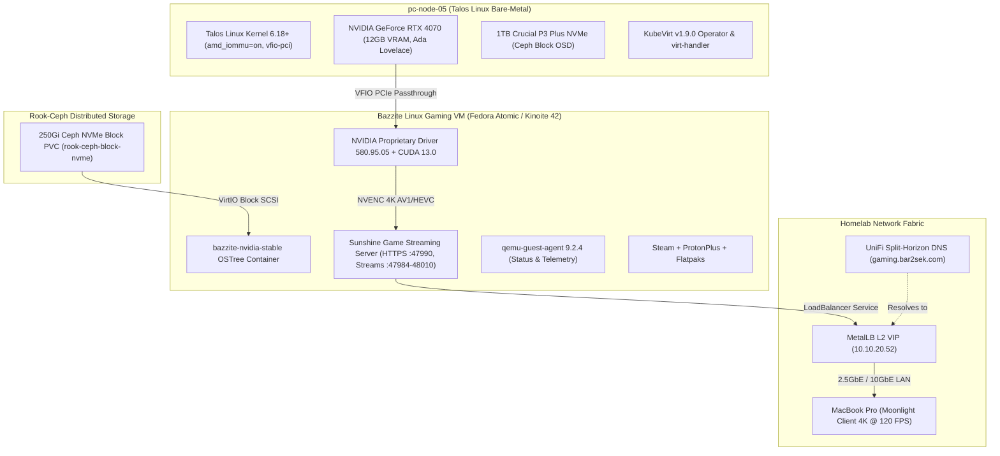

# KubeVirt Bazzite Gaming VM with NVIDIA RTX 4070 GPU Passthrough

This document outlines the architecture, kernel configuration, and deployment workflow to run a **Bazzite Linux Cloud Gaming Virtual Machine** with **NVIDIA GeForce RTX 4070 VFIO PCIe Passthrough** inside our bare-metal Talos Linux Kubernetes cluster using **KubeVirt**.

---

## 🎯 Architecture Overview



---

## 🛠 Step 1: Talos Linux Kernel Configuration (`pc-node-05`)

VFIO GPU Passthrough on the AMD Ryzen 5 7600 (AM5 B650I platform) is declared in `talos/cluster-template.yaml`:

```yaml
machine:
  kernel:
    args:
      - amd_iommu=on
      - iommu=pt
      - vfio-pci.ids=10de:2786,10de:22bc # Vendor:Device IDs for RTX 4070 Video & Audio
```

- **`amd_iommu=on iommu=pt`**: Enables IOMMU hardware isolation for PCIe devices.
- **`vfio-pci.ids`**: Binds the RTX 4070 video and audio controllers to `vfio-pci` at boot so host Talos drivers do not claim them.

---

## 🚀 Step 2: KubeVirt Device Plugins (`kubevirt-cr.yaml`)

GPU & HostDevice Passthrough is enabled in `kubernetes/infrastructure/kubevirt/kubevirt-cr.yaml`:

```yaml
apiVersion: kubevirt.io/v1
kind: KubeVirt
metadata:
  name: kubevirt
  namespace: kubevirt
spec:
  configuration:
    developerConfiguration:
      featureGates:
        - GPU
        - HostDevices
        - VMPersistentState
        - HotplugVolumes
    permittedHostDevices:
      pciHostDevices:
        - pciVendorSelector: "10DE:2786"
          resourceName: "nvidia.com/RTX_4070"
        - pciVendorSelector: "10DE:22BC"
          resourceName: "nvidia.com/RTX_4070_Audio"
  vmStateStorageClass: rook-ceph-filesystem
```

---

## 📦 Step 3: Containerized Data Importer (CDI) ISO Ingestion

The official Bazzite NVIDIA Stable ISO is ingested into Ceph block storage using `kubernetes/infrastructure/kubevirt/bazzite-iso-dv.yaml`:

```yaml
apiVersion: cdi.kubevirt.io/v1beta1
kind: DataVolume
metadata:
  name: bazzite-nvidia-iso
  namespace: vms
spec:
  source:
    http:
      url: "https://download.bazzite.gg/bazzite-nvidia-stable-amd64.iso"
  storage:
    accessModes:
      - ReadWriteOnce
    resources:
      requests:
        storage: 15Gi
    storageClassName: rook-ceph-block
    volumeMode: Filesystem
```

---

## 🎮 Step 4: Production Bazzite VirtualMachine Manifest

The production manifest is defined in `kubernetes/infrastructure/kubevirt/bazzite-vm.yaml`. Once the OS is installed, installation media is removed and only the Ceph NVMe block PVC remains attached:

```yaml
apiVersion: kubevirt.io/v1
kind: VirtualMachine
metadata:
  name: bazzite-gaming-vm
  namespace: vms
  labels:
    app: bazzite-gaming
    special: bazzite-gaming
spec:
  runStrategy: Always
  template:
    metadata:
      labels:
        app: bazzite-gaming
        kubevirt.io/domain: bazzite-gaming-vm
    spec:
      nodeSelector:
        kubernetes.io/hostname: pc-node-05
      domain:
        cpu:
          model: host-passthrough
          cores: 12
          threads: 1
          sockets: 1
        resources:
          requests:
            memory: 16Gi
          limits:
            memory: 16Gi
        devices:
          disks:
            - name: rootdisk
              bootOrder: 1
              disk:
                bus: virtio
          interfaces:
            - name: default
              masquerade: {}
          gpus:
            - name: rtx4070
              deviceName: nvidia.com/RTX_4070
            - name: rtx4070-audio
              deviceName: nvidia.com/RTX_4070_Audio
          inputs:
            - type: tablet
              bus: usb
              name: tablet
        features:
          acpi: {}
          apic: {}
        firmware:
          bootloader:
            efi:
              secureBoot: false
      networks:
        - name: default
          pod: {}
      volumes:
        - name: rootdisk
          persistentVolumeClaim:
            claimName: windows-gaming-nvme-pvc
---
apiVersion: v1
kind: Service
metadata:
  name: bazzite-gaming-lan
  namespace: vms
  annotations:
    metallb.universe.tf/loadBalancerIPs: 10.10.20.52
spec:
  type: LoadBalancer
  selector:
    kubevirt.io/domain: bazzite-gaming-vm
  ports:
    - name: ssh
      port: 22
      targetPort: 22
      protocol: TCP
    - name: sunshine-ui
      port: 47990
      targetPort: 47990
      protocol: TCP
    - name: sunshine-https
      port: 47984
      targetPort: 47984
      protocol: TCP
    - name: sunshine-http
      port: 47989
      targetPort: 47989
      protocol: TCP
    - name: sunshine-ctrl-tcp
      port: 48010
      targetPort: 48010
      protocol: TCP
    - name: sunshine-rtsp
      port: 48010
      targetPort: 48010
      protocol: UDP
    - name: sunshine-video
      port: 47999
      targetPort: 47999
      protocol: UDP
    - name: sunshine-audio
      port: 47998
      targetPort: 47998
      protocol: UDP
    - name: sunshine-ctrl-udp
      port: 48000
      targetPort: 48000
      protocol: UDP
    - name: sunshine-mic
      port: 48002
      targetPort: 48002
      protocol: UDP
```

---

## 📡 Step 5: High-Performance Remote Streaming (Sunshine + Moonlight)

1. **Dedicated LAN VIP (`10.10.20.52`)**: MetalLB exposes ports `47984-48010` (Sunshine HTTP/RTSP/UDP streams) and `22` (OpenSSH).
2. **Sunshine Server**: Pre-installed in Bazzite, running as a systemd user service capturing the RTX 4070 NVENC frame buffer with zero latency.
3. **Web Configuration UI**: Access `https://10.10.20.52:47990` in your web browser to configure PIN pairing for Moonlight clients.
4. **Moonlight Client**: Connect from your MacBook Pro over the **2.5GbE / 10GbE UniFi network** for buttery-smooth 4K 120 FPS gaming with AV1/HEVC encoding!

---

## ⚙️ Operational Commands (`Justfile`)

```bash
# Ping the Bazzite Gaming VM via Ansible
just bazzite-ping

# Run automated post-install configuration & status check
just bazzite-setup

# SSH directly into the VM
ssh bazzite@10.10.20.52 "nvidia-smi"
```
