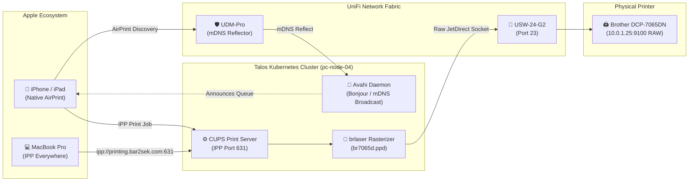

# 🖨️ CUPS & Avahi AirPrint Bridge Architecture

This guide details the network topology, Kubernetes deployment, driver rasterization pipeline, and client onboarding for the **Brother DCP-7065DN** laser multifunction printer hosted on the Talos Kubernetes cluster.

---

## 🎯 Architectural Overview

The **Brother DCP-7065DN** (manufactured ~2011) is a monochrome laser workhorse with integrated Ethernet. However, because it predates modern Apple AirPrint / IPP Everywhere standards, modern macOS and iOS devices cannot natively discover or print to it without vendor-specific rasterizer drivers (which are discontinued on modern Apple Silicon macOS).

To solve this, we deploy a containerized **CUPS (Common Unix Printing System)** and **Avahi mDNS bridge** directly onto the Talos Kubernetes cluster (`pc-node-04`).



### Key Capabilities
- **Universal Apple AirPrint**: Zero drivers required on iOS, iPadOS, or macOS. The CUPS bridge advertises standard URF/PWG-raster capabilities via Bonjour.
- **Open-Source Rasterization**: Uses the open-source [`brlaser`](https://github.com/pdewacht/brlaser) driver package (`br7065d.ppd`) to convert CUPS raster streams into Brother's proprietary Host-Based Printing protocol (`application/vnd.brother-hbp`).
- **Declarative Infrastructure**: Both the network reservation (Terraform) and Kubernetes bridge (manifests) are 100% declared in code.
- **Zero Workstation Drift**: macOS printer queue is declaratively managed via `nix-darwin` in `nix-mac`.

---

## 🌐 Network & DNS Infrastructure (Terraform)

The printer is physically patched into **Port 23** on the primary access switch (`USW-24-G2`).

### 1. Static DHCP Reservation (`terraform/unifi/main.tf`)
The printer's hardware MAC is pinned to a dedicated static IP on the Default LAN (`10.0.1.0/24`):

```hcl
resource "unifi_client" "brother_printer" {
  mac             = var.printer_mac_address # 30:05:5c:18:d8:79
  name            = "Brother DCP-7065DN Laser Printer"
  note            = "Physical monochrome laser multifunction printer connected to USW-24-G2 Port 23"
  fixed_ip        = var.printer_ip          # 10.0.1.25
  network_id      = data.unifi_network.default.id
  allow_existing  = true
}
```

### 2. Authoritative Split-Horizon DNS (`terraform/unifi/dns.tf`)
Two local DNS A records are managed on the UDM-Pro gateway:

| FQDN | Target IP | Description |
| :--- | :--- | :--- |
| `printer.bar2sek.com` | `10.0.1.25` | Physical printer onboard web administration interface and raw JetDirect port 9100. |
| `printing.bar2sek.com` | `10.10.20.20` | Kubernetes CUPS AirPrint bridge (hosted on `pc-node-04` host network). |

### 3. UniFi Multicast DNS (mDNS) Reflector
To allow AirPrint discovery to cross between VLANs (e.g., trusted Wi-Fi clients on Default LAN or trusted subnets to Kubernetes nodes on `10.10.20.0/24`), Multicast DNS is enabled on the UniFi Dream Machine Pro:
- **Location**: UniFi Network Console $\rightarrow$ **Settings** $\rightarrow$ **Networks** $\rightarrow$ **Global Network Settings** $\rightarrow$ **Multicast DNS** (set to **Auto** or enabled across client networks).

---

## 📦 Kubernetes CUPS Bridge (`kubernetes/apps/cups/cups.yaml`)

The printing service is deployed in the `printing` namespace on `talos-aws-homelab`.

### Manifest Details

```yaml
apiVersion: v1
kind: Namespace
metadata:
  name: printing
  labels:
    pod-security.kubernetes.io/enforce: privileged
    pod-security.kubernetes.io/audit: privileged
    pod-security.kubernetes.io/warn: privileged
---
apiVersion: v1
kind: PersistentVolumeClaim
metadata:
  name: cups-config-pvc
  namespace: printing
spec:
  accessModes:
    - ReadWriteOnce
  storageClassName: rook-ceph-block
  resources:
    requests:
      storage: 1Gi
---
apiVersion: apps/v1
kind: Deployment
metadata:
  name: airprint-bridge
  namespace: printing
  labels:
    app: airprint-bridge
spec:
  replicas: 1
  strategy:
    type: Recreate
  selector:
    matchLabels:
      app: airprint-bridge
  template:
    metadata:
      labels:
        app: airprint-bridge
    spec:
      hostNetwork: true
      dnsPolicy: ClusterFirstWithHostNet
      nodeSelector:
        kubernetes.io/hostname: pc-node-04
      initContainers:
        - name: init-cups-config
          image: drpsychick/airprint-bridge:latest
          command:
            - /bin/sh
            - -c
            - |
              if [ ! -f /etc/cups-storage/cups-files.conf ]; then
                echo "Seeding initial CUPS configuration..."
                cp -rn /etc/cups/* /etc/cups-storage/ || true
              fi
          volumeMounts:
            - mountPath: /etc/cups-storage
              name: cups-config
      containers:
        - name: cups
          image: drpsychick/airprint-bridge:latest
          env:
            - name: TZ
              value: "America/Chicago"
            - name: CUPS_ADMIN_USER
              value: "admin"
            - name: CUPS_ADMIN_PASSWORD
              value: "homelab"
            - name: CUPS_WEBINTERFACE
              value: "yes"
            - name: CUPS_REMOTE_ADMIN
              value: "yes"
            - name: CUPS_LPADMIN_PRINTER1
              value: "lpadmin -p Brother_DCP-7065DN -D 'Brother DCP-7065DN' -L 'Homelab Rack' -m drv:///brlaser.drv/br7065d.ppd -v socket://10.0.1.25:9100 -E"
            - name: PRE_INIT_HOOK
              value: "sed -i '/^Port 631/d' /etc/cups/cupsd.conf || true; sed -i '/^ServerAlias /d' /etc/cups/cupsd.conf || true; echo 'ServerAlias *' >> /etc/cups/cupsd.conf"
            - name: AVAHI_IPV6
              value: "no"
          ports:
            - containerPort: 631
              name: ipp
          resources:
            requests:
              cpu: 50m
              memory: 128Mi
            limits:
              cpu: 500m
              memory: 512Mi
          volumeMounts:
            - mountPath: /etc/cups
              name: cups-config
      volumes:
        - name: cups-config
          persistentVolumeClaim:
            claimName: cups-config-pvc
---
apiVersion: v1
kind: Service
metadata:
  name: cups-service
  namespace: printing
spec:
  type: ClusterIP
  ports:
    - port: 631
      targetPort: 631
      name: ipp
  selector:
    app: airprint-bridge
```

### Architectural Highlights & Gotchas Solved

1. **Host Network Mode (`hostNetwork: true`)**:
   - Avahi must broadcast link-local mDNS (`224.0.0.251:5353`) onto the physical subnet interface. Running inside standard Kubernetes CNI overlay encapsulation would prevent physical devices from receiving Bonjour broadcasts.
2. **Node Placement (`nodeSelector: pc-node-04`)**:
   - The 3 Supermicro control plane nodes (`sm-node-01..03`) boot from 16GB SATA SuperDOM modules with strict ephemeral storage pressure limits. Scheduling user container workloads on storage worker `pc-node-04` protects control plane stability.
3. **PPD Name Precision**:
   - The `brlaser` driver specifies `br7065d.ppd` for this model (not `br7065dn.ppd`).
4. **CUPS Port Collision & DNS Rebinding Fix (`PRE_INIT_HOOK`)**:
   - The upstream container appends `Listen *:631` to `/etc/cups/cupsd.conf` on boot while shipping with `Port 631` already present, crashing the daemon. The hook strips duplicate `Port 631`.
   - CUPS enforces strict Host header matching to prevent DNS rebinding attacks. Without `ServerAlias *`, requests addressed to `printing.bar2sek.com` are rejected with `HTTP 400 Bad Request`. The hook injects `ServerAlias *` into `cupsd.conf`.
5. **Entrypoint Script Trap (`CUPS_LPADMIN_PRINTER*`)**:
   - The image loops over variables matching `CUPS_LPADMIN_PRINTER*` and evaluates them with `eval`. Setting `..._ENABLE="yes"` causes bash to run the `/bin/yes` binary, generating infinite output. Enabling is handled cleanly with `-E` directly inside the `lpadmin` command string.

---

## 💻 Client Configuration

### A. Declarative macOS Setup (`nix-mac`)
The MacBook Pro automatically configures and maintains the printer queue via `nix-darwin`.

In `nix-mac/templates/flake.nix` (synchronized to `~/.config/nix-darwin/flake.nix`):

```nix
system.activationScripts.postActivation.text = ''
  # Declaratively configure AirPrint CUPS queue for Brother DCP-7065DN
  if ! lpstat -p Brother_DCP_7065DN >/dev/null 2>&1; then
    echo "Configuring Brother DCP-7065DN network printer..."
    lpadmin -p Brother_DCP_7065DN \
      -E \
      -v ipp://printing.bar2sek.com:631/printers/Brother_DCP-7065DN \
      -m everywhere \
      -D "Brother DCP-7065DN" \
      -L "Homelab Rack" || true
    lpoptions -d Brother_DCP_7065DN || true
  fi
'';
```

Apply via:
```bash
just switch
```

### B. Manual macOS Setup (GUI)
If setting up on an unmanaged Mac:
1. Open **System Settings** $\rightarrow$ **Printers & Scanners**.
2. Click **Add Printer, Scanner, or Fax...** (`+`).
3. Select the **IP** tab (globe icon):
   - **Address**: `printing.bar2sek.com`
   - **Protocol**: `Internet Printing Protocol - IPP`
   - **Queue**: `printers/Brother_DCP-7065DN`
   - **Name**: `Brother DCP-7065DN`
   - **Use**: `AirPrint` (or `Generic PostScript Printer`)
4. Click **Add**.

### C. iOS & iPadOS Printing
1. Ensure the device is connected to home Wi-Fi.
2. Open any document, photo, or webpage $\rightarrow$ Tap **Share** $\rightarrow$ **Print**.
3. Tap **Select Printer** $\rightarrow$ Choose **Brother DCP-7065DN @ pc-node-04**.
4. Configure duplex (2-sided) or copies and tap **Print**.

---

## 🔧 Operational Runbook & Diagnostics

### 1. Health Checks

Check CUPS endpoint response:
```bash
curl -Is http://printing.bar2sek.com:631/printers/Brother_DCP-7065DN | head -n 5
# Expected: HTTP/1.1 200 OK
```

Verify macOS print queue status:
```bash
lpstat -p Brother_DCP_7065DN -l
# Expected: printer Brother_DCP_7065DN is idle. enabled since ...
```

Inspect Kubernetes pod logs:
```bash
kubectl logs -n printing -l app=airprint-bridge --tail=50
```

### 2. Common Gotchas & Troubleshooting

| Symptom | Cause | Resolution |
| :--- | :--- | :--- |
| **Printer Add button greyed out on Mac** | Mac detected raw printer via Bonjour, but cannot find a local PPD driver. | Use the CUPS bridge URL (`ipp://printing.bar2sek.com:631/printers/Brother_DCP-7065DN`) or select AirPrint. |
| **`HTTP 400 Bad Request` from CUPS** | CUPS host rebinding protection rejecting hostname. | Ensure `ServerAlias *` is present in `/etc/cups/cupsd.conf` (applied via `PRE_INIT_HOOK`). |
| **Printer not reachable on `10.0.1.25`** | Physical printer still holding old DHCP lease (`10.0.1.237`). | Power-cycle the Brother printer physically so it requests a new lease and receives `10.0.1.25`. |
| **iOS cannot discover printer** | UniFi mDNS reflector disabled between Wi-Fi and node subnets. | Turn on Multicast DNS (Auto) in UniFi Network Settings. |
| **Print job stuck in queue** | CUPS cannot reach printer on port 9100. | Test raw port with `nc -zv 10.0.1.25 9100`. Verify switch Port 23 link status. |
